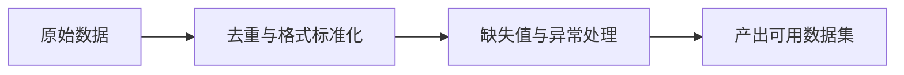

## 1. 背景
- **问题场景**: 数据质量差时，模型训练和评测都会失真，后面再补救成本很高。
- **学习目标**: 建立数据清洗的基本意识，理解去重、格式统一、缺失值处理和异常样本识别的重要性。
- **前置知识**: 了解表格数据、文本数据和基础数据处理流程。

## 2. 核心结论
- 数据问题越早暴露，修复成本越低。
- 清洗的目标不是把数据“洗得越干净越好”，而是让数据更可用、更一致、更可信。
- 去重、标准化、缺失值处理和异常检测是最常见的清洗动作。
- 数据清洗要保留规则和日志，否则后续很难复现。

## 3. 原理拆解
- **关键概念**: 数据清洗是数据进入训练、评测或上线前的质量控制环节。
- **运行机制**: 原始数据经过规则检查、格式标准化和异常剔除后，进入后续特征工程或标注流程。
- **图示说明**: 清洗是连接原始数据和可用数据资产之间的必经步骤。



## 4. 实战步骤

### 4.1 环境准备
- 依赖版本: Python 3.9+、pandas
- 安装命令:

```bash
pip install pandas
```

### 4.2 核心代码

```python
import pandas as pd


df = pd.DataFrame(
    [
        {"question": "退款多久到账", "label": "refund"},
        {"question": "退款多久到账", "label": "refund"},
        {"question": None, "label": "refund"},
    ]
)

clean_df = (
    df.drop_duplicates()
      .dropna(subset=["question"])
      .assign(question=lambda frame: frame["question"].str.strip())
)
```

### 4.3 如何验证
- 本地运行命令: 运行数据处理脚本并检查输出样本数、缺失率和重复率变化。
- 预期结果: 重复数据减少、关键字段缺失被处理、格式更统一。
- 失败时重点检查: 规则是否误删有效样本、字段标准化是否破坏原意、清洗前后统计是否可对比。

```bash
python clean_dataset.py
```

## 5. 项目实践建议
- **适用场景**: 训练数据、评测数据、问答样本、日志样本和标注前数据准备。
- **不适用场景**: 完全没有数据来源和业务口径时，盲目“洗数据”意义不大。
- **落地建议**: 每条清洗规则都尽量可解释、可复现、可统计。
- **与其他方案对比**: 与手工零散清洗相比，规则化清洗更适合长期迭代和协作。

## 6. 踩坑记录
- **常见问题**: 一次性写很多清洗规则，但没有记录哪些样本被删掉。
- **错误现象**: 数据量变少了很多，却说不清质量是变好了还是被误删了。
- **定位方式**: 对比清洗前后样本数量、类别分布和异常样本样例。
- **解决方案**: 清洗脚本要输出统计摘要和异常样本日志。

## 7. 面试高频 Q&A
### Q1: 数据清洗为什么对模型效果影响这么大？
### A1:
因为模型学习的就是数据分布。如果输入数据本身混乱、重复或错误，再强的模型也很难学到稳定模式。

### Q2: 去重是不是一定越多越好？
### A2:
不是。关键要区分“无意义重复”与“真实频次信号”，盲目去重可能会破坏数据分布。

## 8. 延伸阅读
- [pandas Documentation](https://pandas.pydata.org/docs/)
- [Data Cascades](https://sites.google.com/view/data-cascades/home)
- [Cleanlab](https://cleanlab.ai/)

## 9. 关联内容
- 相关笔记: 后续可补 `advanced/` 中的数据质量评估与异常样本治理
- 相关代码: [cleaning 目录](../README.md)
- 相关测试: 可与 AI 评测模块共享评测样本治理流程

---
[返回首页](../../../../README.md)
