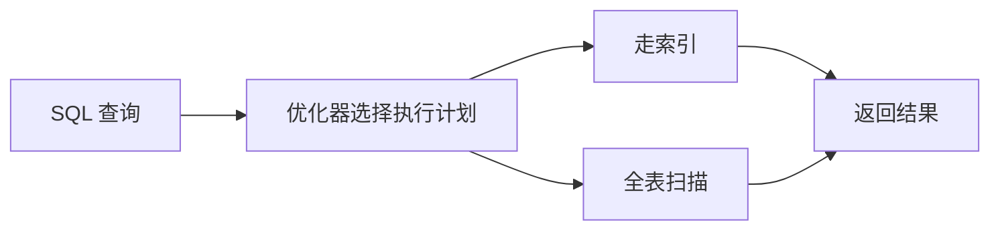

## 1. 背景
- **问题场景**: SQL 在小数据量下看起来都很快，但数据量一上来，索引设计不合理会迅速暴露性能瓶颈。
- **学习目标**: 建立“为什么建索引、索引如何工作、如何判断索引是否有效”的基础认知。
- **前置知识**: 了解 SQL、表结构和基础查询语句。

## 2. 核心结论
- 索引的目标不是“建得越多越好”，而是让高频关键查询更快。
- 索引会提升查询性能，但会带来写入和存储成本。
- 常见优化重点在于 where、order by、join 和覆盖索引。
- `EXPLAIN` 是理解索引是否真正生效的重要入口。

## 3. 原理拆解
- **关键概念**: 索引可以把无序扫描转换成更高效的定位路径，B+Tree 是常见实现。
- **运行机制**: 查询条件命中索引时，数据库可通过索引快速找到目标记录或更小的数据范围。
- **图示说明**: 索引相当于为数据建立可快速定位的目录结构。



## 4. 实战步骤

### 4.1 环境准备
- 依赖版本: MySQL 8.x
- 安装命令: 依据本地数据库环境配置

```bash
mysql --version
```

### 4.2 核心代码

```sql
CREATE TABLE orders (
  id BIGINT PRIMARY KEY,
  user_id BIGINT NOT NULL,
  status VARCHAR(20) NOT NULL,
  created_at DATETIME NOT NULL
);

CREATE INDEX idx_user_status_created_at
ON orders (user_id, status, created_at);

EXPLAIN
SELECT id, status
FROM orders
WHERE user_id = 1001 AND status = 'PAID'
ORDER BY created_at DESC
LIMIT 20;
```

### 4.3 如何验证
- 本地运行命令: 执行 `EXPLAIN` 查看执行计划。
- 预期结果: 高频查询能合理命中索引，而不是大范围全表扫描。
- 失败时重点检查: 查询条件顺序、索引列顺序、是否出现回表过多、是否有函数操作破坏索引使用。

```bash
mysql -u root -p
```

## 5. 项目实践建议
- **适用场景**: 订单、用户、交易、日志检索等高频查询表。
- **不适用场景**: 数据量极小、查询很少、写入极频繁且查询简单的表。
- **落地建议**: 先基于真实 SQL 和访问模式设计索引，不要只凭感觉加索引。
- **与其他方案对比**: 与盲目堆索引相比，围绕核心查询路径设计索引更节省成本也更有效。

## 6. 踩坑记录
- **常见问题**: 建了索引，但 SQL 仍然很慢。
- **错误现象**: `EXPLAIN` 依旧显示扫描行数很高，或者根本没走到预期索引。
- **定位方式**: 检查 where 条件、联合索引顺序、排序字段和查询返回列。
- **解决方案**: 从真实慢 SQL 出发优化，而不是只看表结构。

## 7. 面试高频 Q&A
### Q1: 为什么索引不是越多越好？
### A1:
因为索引会增加写入开销、占用存储空间，还会增加优化器选择成本。无效索引只会让系统更复杂。

### Q2: 联合索引为什么要关注列顺序？
### A2:
因为联合索引的使用效果与最左前缀原则密切相关，列顺序直接影响哪些查询能命中索引。

## 8. 延伸阅读
- [MySQL Documentation](https://dev.mysql.com/doc/)
- [MySQL EXPLAIN](https://dev.mysql.com/doc/refman/8.0/en/explain.html)
- [Use The Index, Luke](https://use-the-index-luke.com/)

## 9. 关联内容
- 相关笔记: 后续可补 `advanced/` 中的联合索引与回表优化
- 相关代码: [mysql 目录](../README.md)
- 相关测试: 可结合性能测试验证 SQL 优化前后差异

---
[返回首页](../../../../README.md)
