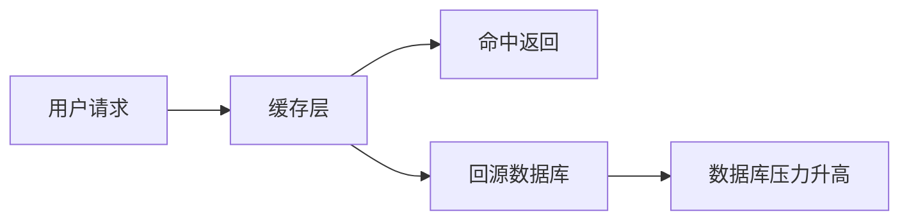

## 1. 背景
- **问题场景**: 高并发系统里，缓存层如果设计不当，数据库会被瞬间打穿，进而引发连锁故障。
- **学习目标**: 区分缓存击穿、缓存穿透和缓存雪崩，并理解常见治理手段。
- **前置知识**: 了解缓存、数据库、热点数据和基本并发概念。

## 2. 核心结论
- 缓存击穿、穿透和雪崩虽然都表现为缓存失效带来的压力上升，但根因不同。
- 治理这三类问题的方案也不同，不能混成一种“加缓存就行”的思路。
- 高并发缓存设计的重点不是命中率数字，而是故障时的系统承压能力。
- 缓存层必须和限流、降级、熔断一起看，单点优化不够。

## 3. 原理拆解
- **关键概念**: 击穿通常对应热点 Key 过期；穿透对应请求不存在的数据；雪崩对应大量 Key 同时失效。
- **运行机制**: 当缓存层无法承接请求时，流量回落到数据库或下游服务，造成集中压力。
- **图示说明**: 三类问题都发生在“缓存防线失效后流量回流”这一链路上。



## 4. 实战步骤

### 4.1 环境准备
- 依赖版本: Redis、MySQL 或任意缓存 + 持久化组合
- 安装命令: 按实际项目环境准备

```bash
redis-server --version
```

### 4.2 核心代码

```python
def get_product(product_id):
    cache_key = f"product:{product_id}"
    value = redis_client.get(cache_key)
    if value:
        return value

    with distributed_lock(cache_key):
        value = redis_client.get(cache_key)
        if value:
            return value

        data = db.query_product(product_id)
        if data is None:
            redis_client.setex(cache_key, 60, "NULL")
            return None

        redis_client.setex(cache_key, 300, data)
        return data
```

### 4.3 如何验证
- 本地运行命令: 在压测或并发模拟环境下观察热点 Key 过期时的回源行为。
- 预期结果: 热点失效时只有少量请求回源，其余请求能被锁、缓存空值或降级逻辑保护。
- 失败时重点检查: 锁是否生效、空值缓存是否启用、TTL 是否过于集中。

```bash
python cache_demo.py
```

## 5. 项目实践建议
- **适用场景**: 商品详情、配置中心、热点查询、推荐结果缓存。
- **不适用场景**: 对一致性要求极高且不允许短暂旧值的极端场景。
- **落地建议**: 热点 Key、空值缓存、随机过期和服务降级要组合使用。
- **与其他方案对比**: 与只追求缓存命中率相比，韧性设计更关注故障场景的安全退化。

## 6. 踩坑记录
- **常见问题**: 所有缓存使用同样 TTL，导致同一时刻批量过期。
- **错误现象**: 某一时间点数据库 QPS 飙升，缓存命中率骤降。
- **定位方式**: 查看 Key 过期分布、热点请求轨迹和数据库瞬时压力。
- **解决方案**: 对 TTL 加随机抖动，并识别热点 Key 做专项保护。

## 7. 面试高频 Q&A
### Q1: 击穿、穿透、雪崩最核心的区别是什么？
### A1:
区别在于失效原因不同。击穿是热点 Key 问题，穿透是请求不存在的数据，雪崩是大量缓存同时失效。

### Q2: 为什么说缓存问题不能只靠 Redis 解决？
### A2:
因为真正的系统稳定性还依赖数据库承压能力、限流、降级和流量治理，缓存只是其中一层防线。

## 8. 延伸阅读
- [Redis Documentation](https://redis.io/docs/latest/)
- [Designing Data-Intensive Applications](https://dataintensive.net/)
- [Google SRE Book](https://sre.google/sre-book/table-of-contents/)

## 9. 关联内容
- 相关笔记: 后续可补 `advanced/` 中的热点缓存治理与一致性设计
- 相关代码: [caching 目录](../README.md)
- 相关测试: 可与性能压测内容联动验证缓存失效场景

---
[返回首页](../../../../README.md)
