# 项目结构图与知识库分层

> 这个仓库的目标不是只放零散笔记，而是沉淀成一个可检索、可扩展、可复用的工程知识库。

---

## 1. 整体结构图

```mermaid
flowchart TD
    ROOT["over-300k-journey<br/>工程知识库"]

    ROOT --> TESTING["testing<br/>软件测试"]
    ROOT --> FRONTEND["frontend<br/>前端开发"]
    ROOT --> BACKEND["backend<br/>后端开发"]
    ROOT --> AI["ai<br/>AI 开发"]
    ROOT --> COMMON["common<br/>公共规范 / 工具 / 索引"]
    ROOT --> SCRIPTS["scripts<br/>初始化与自动化"]

    TESTING --> TUI["ui"]
    TESTING --> TAPI["api"]
    TESTING --> TPERF["performance"]
    TESTING --> TMOBILE["mobile"]
    TESTING --> TAIEVAL["ai-eval"]
    TESTING --> TSTRATEGY["strategy"]

    TUI --> PLAYWRIGHT["playwright"]
    TUI --> SELENIUM["selenium"]
    TAPI --> PYTEST["pytest"]
    TAPI --> RESTASSURED["rest-assured"]
    TPERF --> K6["k6"]
    TPERF --> JMETER["jmeter"]
    TAIEVAL --> RAGAS["ragas"]
    TAIEVAL --> DEEPEVAL["deepeval"]

    FRONTEND --> FFRAMEWORKS["frameworks"]
    FRONTEND --> FENGINEERING["engineering"]
    FRONTEND --> FPERFORMANCE["performance"]

    BACKEND --> BDISTRIBUTED["distributed"]
    BACKEND --> BDATABASE["database"]
    BACKEND --> BSYSTEM["system-design"]

    AI --> ALLM["llm-agent"]
    AI --> AMLOPS["mlops"]
    AI --> ADATASET["dataset"]

    COMMON --> CDOCS["docs"]
    COMMON --> CTOOLS["tools"]
    COMMON --> CSNIPPETS["snippets"]
    COMMON --> CCHECKLISTS["checklists"]
```

---

## 2. 知识库推荐分层

对每个“技术栈目录”，建议统一使用下面这套内容分层：

| 目录 | 作用 | 适合放什么 |
| :--- | :--- | :--- |
| `basics/` | 入门与基础 | 核心概念、环境搭建、基础 API、第一份 Demo |
| `advanced/` | 进阶与原理 | 架构设计、源码理解、性能优化、复杂场景 |
| `projects/` | 实战与案例 | 完整项目、最佳实践、线上问题复盘、方案对比 |
| `interview/` | 面试与输出 | 高频题、八股整理、答题模板、知识回顾 |
| `assets/` | 附件资源 | 图片、Mermaid 源稿、流程图、截图、附件 |

这意味着后续新增内容时，优先按照：

`模块 -> 领域 -> 技术栈 -> 内容层级 -> 笔记/代码/资源`

来放置。

---

## 3. 推荐路径示例

| 你想沉淀的内容 | 推荐路径 |
| :--- | :--- |
| Playwright 入门 | `testing/ui/playwright/basics/` |
| 接口契约测试案例 | `testing/api/pytest/projects/` |
| 前端 React 性能优化 | `frontend/frameworks/react/advanced/` |
| 微服务限流熔断 | `backend/distributed/resilience/advanced/` |
| MySQL 索引与调优 | `backend/database/mysql/advanced/` |
| RAG 召回评测 | `testing/ai-eval/ragas/projects/` |
| Prompt 设计方法论 | `ai/llm-agent/prompt/basics/` |
| Agent 工具调用设计 | `ai/llm-agent/agent/advanced/` |
| 模型部署与监控 | `ai/mlops/deployment/projects/` |

---

## 4. 模块职责

### `testing/`
- 软件测试主知识域。
- 适合沉淀 UI 自动化、接口测试、性能测试、移动端测试、AI 评测、测试策略。

### `frontend/`
- 前端开发主知识域。
- 适合沉淀框架原理、工程化、构建工具、性能优化、跨端方案。

### `backend/`
- 后端开发主知识域。
- 适合沉淀分布式系统、数据库、中间件、稳定性、系统设计。

### `ai/`
- AI 工程主知识域。
- 适合沉淀 Prompt、RAG、Agent、MLOps、数据集工程。

### `common/`
- 公共支撑层。
- 放规范文档、通用脚本、复用片段、检查清单、导航索引。

### `scripts/`
- 自动化脚本层。
- 负责初始化目录、批量检查、导出等仓库运维工作。

---

## 5. 一篇知识笔记应该长什么样

统一使用 [template.md](./template.md) 来写内容，保证每篇笔记至少具备：

1. 背景与业务场景
2. 原理与关键设计
3. 可运行示例或关键代码
4. 测试/验证方式
5. 踩坑记录
6. 面试高频 Q&A
7. 参考资料

---

## 6. 使用建议

1. 先运行 `python scripts/init_dirs.py`，把目录骨架补全。
2. 每新增一个知识点，优先放到准确的技术栈目录，而不是堆在根目录。
3. 每个技术栈建议保留一个 `README.md` 作为索引页，汇总该目录的知识地图。
4. 笔记、代码、测试、图示尽量同目录就近存放，降低后续检索成本。
5. 周期性运行导出脚本，把知识库转成 PDF、Anki 或能力图。

---

[返回首页](../../README.md)
