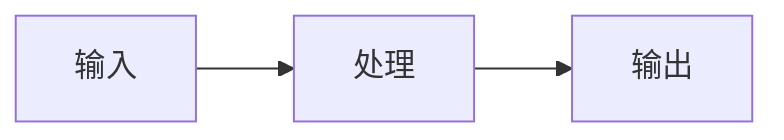

# 📝 知识笔记标准模板

> 每一篇笔记都应当既能“自己复习”，也能“给别人交付”。

---

```yaml
---
title: Playwright 网络拦截与接口 Mock
module: testing
area: ui
stack: playwright
level: advanced
status: draft
tags: [playwright, mocking, e2e]
updated: 2026-04-16
---
```

## 1. 背景
- **问题场景**: 这个知识点通常出现在哪类业务中？
- **学习目标**: 学完之后能够解决什么问题？
- **前置知识**: 阅读本文前建议具备什么基础？

## 2. 核心结论
- 用 3 到 5 条短句写出最重要的结论。
- 这一节要保证以后快速复习时只看这里也能回忆起来。

## 3. 原理拆解
- **关键概念**: 定义、边界、适用范围。
- **运行机制**: 请求链路、数据流、调用顺序、约束条件。
- **图示说明**: 推荐补 Mermaid 流程图或架构图。



## 4. 实战步骤

### 4.1 环境准备
- 依赖版本:
- 安装命令:

```bash
python -m venv .venv
```

### 4.2 核心代码

```python
def test_example():
    assert True
```

### 4.3 如何验证
- 本地运行命令:
- 预期结果:
- 失败时重点检查:

```bash
pytest tests/test_example.py
```

## 5. 项目实践建议
- **适用场景**:
- **不适用场景**:
- **落地建议**:
- **与其他方案对比**:

## 6. 踩坑记录
- **常见问题**:
- **错误现象**:
- **定位方式**:
- **解决方案**:

## 7. 面试高频 Q&A
### Q1: 这个方案解决了什么核心问题？
### A1:

### Q2: 它和替代方案的差异是什么？
### A2:

## 8. 延伸阅读
- [官方文档](https://example.com)
- [源码仓库](https://example.com)
- [深入文章](https://example.com)

## 9. 关联内容
- 相关笔记:
- 相关代码:
- 相关测试:

---
[返回首页](../../README.md)
