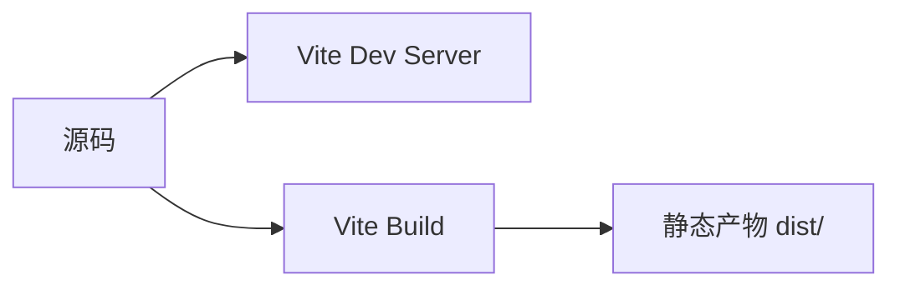

## 1. 背景
- **问题场景**: 前端工程化不是只会跑 `npm run dev`，还要理解开发态和生产构建态为什么不一样。
- **学习目标**: 建立 Vite 本地开发、依赖预构建和生产打包的整体认知。
- **前置知识**: 了解 npm、模块化和基础前端项目结构。

## 2. 核心结论
- Vite 开发阶段强调快启动和按需编译，生产阶段强调打包优化和静态资源输出。
- 开发态和生产态不是同一件事，问题也往往出现在两者差异里。
- 工程化的关键是理解“源码如何变成浏览器可运行资源”。
- 构建工具配置越透明，定位问题越容易。

## 3. 原理拆解
- **关键概念**: 开发态通常依赖原生 ESM 和按需处理，生产态通常做打包、压缩、分块与资源优化。
- **运行机制**: Vite 在开发阶段使用开发服务器即时处理模块，在构建阶段通过 Rollup 完成产物输出。
- **图示说明**: 一条前端构建流水线可以简化为“源码 -> 开发服务 / 构建产物”两条路径。



## 4. 实战步骤

### 4.1 环境准备
- 依赖版本: Node.js 18+、Vite
- 安装命令:

```bash
npm create vite@latest
```

### 4.2 核心代码

```ts
import { defineConfig } from "vite";

export default defineConfig({
  server: {
    port: 5173,
  },
  build: {
    sourcemap: true,
  },
});
```

### 4.3 如何验证
- 本地运行命令: `npm run dev` 和 `npm run build`
- 预期结果: 开发态能快速启动，构建态能正常输出 `dist/` 目录。
- 失败时重点检查: 资源路径、环境变量、别名配置和第三方依赖兼容性。

```bash
npm run dev
npm run build
```

## 5. 项目实践建议
- **适用场景**: React、Vue、TypeScript 前端项目的日常开发与部署。
- **不适用场景**: 对构建链极度定制且历史包袱很重的旧项目迁移初期。
- **落地建议**: 先保持配置简单透明，等遇到真实问题再做局部增强。
- **与其他方案对比**: 与传统重配置构建链相比，Vite 更适合作为现代前端项目的起点。

## 6. 踩坑记录
- **常见问题**: 开发环境正常，构建后路径或资源加载异常。
- **错误现象**: 本地看起来没问题，部署后白屏或静态资源 404。
- **定位方式**: 对比 dev 和 build 产物差异，检查 base 路径、环境变量和静态资源引用方式。
- **解决方案**: 把开发态和生产态分别验证，不要用开发态体验替代上线前校验。

## 7. 面试高频 Q&A
### Q1: 为什么 Vite 开发阶段速度通常更快？
### A1:
因为它更多利用浏览器原生 ESM 与按需处理，而不是每次启动都对整个项目做重打包。

### Q2: 为什么前端构建问题常常只在生产环境暴露？
### A2:
因为开发态和生产态路径、压缩、代码分割、环境变量注入等行为不同，很多问题只会在构建产物中体现。

## 8. 延伸阅读
- [Vite 官方文档](https://vite.dev/)
- [Vite Config](https://vite.dev/config/)
- [Vite Build Guide](https://vite.dev/guide/build.html)

## 9. 关联内容
- 相关笔记: 后续可补 `advanced/` 中的代码分割与构建优化
- 相关代码: [build-tools 目录](../README.md)
- 相关测试: 后续可结合前端 CI 验证构建流程

---
[返回首页](../../../../README.md)
