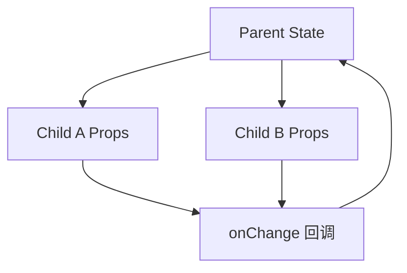

## 1. 背景
- **问题场景**: React 项目中最常见的问题之一，不是“不会写组件”，而是不清楚状态应该放在哪里、组件之间怎么传递。
- **学习目标**: 掌握 React 里最基础也最重要的通信模式，包括 props 下发、事件回传和状态提升。
- **前置知识**: 了解函数组件、JSX 和基础 Hook。

## 2. 核心结论
- 组件通信的第一原则是先保持数据单向流动。
- 多个子组件需要共享状态时，通常先把状态提升到最近的公共父组件。
- 不要一上来就引入全局状态管理，先把局部状态边界理清。
- 好的组件通信设计，会让组件职责更清晰、调试更简单。

## 3. 原理拆解
- **关键概念**: 父组件通过 props 向下传值，子组件通过回调函数把事件和数据向上反馈。
- **运行机制**: 当父组件状态变化时，依赖该状态的子组件会重新渲染。
- **图示说明**: React 最基础的通信模型就是“父传子，子调父”。



## 4. 实战步骤

### 4.1 环境准备
- 依赖版本: React 18+
- 安装命令:

```bash
npm create vite@latest
```

### 4.2 核心代码

```tsx
import { useState } from "react";

function SearchInput({ keyword, onKeywordChange }) {
  return (
    <input
      value={keyword}
      onChange={(event) => onKeywordChange(event.target.value)}
    />
  );
}

function SearchResult({ keyword }) {
  return <p>当前搜索词: {keyword}</p>;
}

export default function SearchPage() {
  const [keyword, setKeyword] = useState("");

  return (
    <>
      <SearchInput keyword={keyword} onKeywordChange={setKeyword} />
      <SearchResult keyword={keyword} />
    </>
  );
}
```

### 4.3 如何验证
- 本地运行命令: `npm run dev`
- 预期结果: 输入框变化时，结果组件同步展示最新状态。
- 失败时重点检查: 状态是否被多个组件各自维护、回调函数是否正确传递。

```bash
npm run dev
```

## 5. 项目实践建议
- **适用场景**: 表单、筛选面板、搜索联动、父子组件协作。
- **不适用场景**: 多页面跨层共享且状态范围明显超出局部树时。
- **落地建议**: 先画清楚“谁持有状态、谁消费状态、谁触发变化”。
- **与其他方案对比**: 与一上来就使用全局状态相比，状态提升更轻量、更贴近 React 原生思维。

## 6. 踩坑记录
- **常见问题**: 子组件偷偷维护一份和父组件重复的状态。
- **错误现象**: 页面显示不同步，两个组件内容各自变化。
- **定位方式**: 查找同一业务值是否被重复声明了多份状态。
- **解决方案**: 明确单一数据源，把状态集中在最合适的上层组件。

## 7. 面试高频 Q&A
### Q1: 为什么 React 强调单向数据流？
### A1:
因为它让数据变化路径更清晰，组件之间的依赖关系更容易推理和调试。

### Q2: 什么时候应该做状态提升？
### A2:
当多个兄弟组件需要共享同一份状态，或者一个组件负责输入、另一个组件负责展示时，就应该优先考虑状态提升。

## 8. 延伸阅读
- [React 官方文档](https://react.dev/)
- [Sharing State Between Components](https://react.dev/learn/sharing-state-between-components)
- [Thinking in React](https://react.dev/learn/thinking-in-react)

## 9. 关联内容
- 相关笔记: 后续可补 `advanced/` 中的 Context 与状态管理设计
- 相关代码: [React 目录](../README.md)
- 相关测试: 后续可结合前端测试补组件行为验证

---
[返回首页](../../../../README.md)
