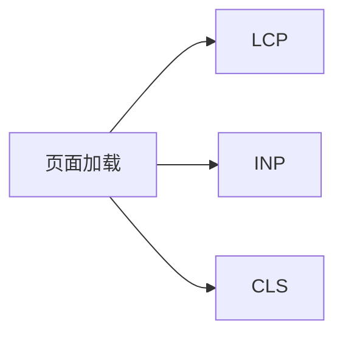

## 1. 背景
- **问题场景**: 页面“能打开”不等于用户体验好，用户真正感知到的是加载速度、交互响应和页面稳定性。
- **学习目标**: 认识 Web Vitals 指标以及为什么团队需要性能预算。
- **前置知识**: 了解浏览器渲染、静态资源和基础性能概念。

## 2. 核心结论
- Web Vitals 把模糊的“页面快不快”转成可度量的指标。
- LCP、INP、CLS 分别反映加载体验、交互体验和视觉稳定性。
- 性能预算能把“尽量优化”变成“不能超过的明确阈值”。
- 没有预算的性能优化，通常很难进入日常工程流程。

## 3. 原理拆解
- **关键概念**: LCP 关注主要内容出现时间，INP 关注交互延迟，CLS 关注页面布局是否跳动。
- **运行机制**: 浏览器在运行时采集关键交互和渲染事件，用于生成用户体验指标。
- **图示说明**: 前端性能优化需要同时关注加载、交互和稳定性三个维度。



## 4. 实战步骤

### 4.1 环境准备
- 依赖版本: 浏览器 DevTools、Lighthouse 或 `web-vitals` 库
- 安装命令:

```bash
npm install web-vitals
```

### 4.2 核心代码

```ts
import { onLCP, onINP, onCLS } from "web-vitals";

onLCP(console.log);
onINP(console.log);
onCLS(console.log);
```

### 4.3 如何验证
- 本地运行命令: 运行页面并结合 DevTools 或真实埋点观察指标输出。
- 预期结果: 能看到核心指标的实时采集结果，并对照预算判断是否达标。
- 失败时重点检查: 测试环境是否接近真实用户条件、首屏资源是否过重、是否存在布局抖动。

```bash
npm run dev
```

## 5. 项目实践建议
- **适用场景**: 面向用户的 Web 应用、营销页、搜索页和高频访问页面。
- **不适用场景**: 完全离线的内部原型验证阶段。
- **落地建议**: 给核心页面设置性能预算，并将预算结果纳入构建或发布检查。
- **与其他方案对比**: 与只看平均加载时间相比，Web Vitals 更贴近用户真实体验。

## 6. 踩坑记录
- **常见问题**: 只在本地高配机器上测性能。
- **错误现象**: 开发机体验很好，真实用户却仍然感到慢。
- **定位方式**: 模拟弱网、低端设备和真实访问路径进行测试。
- **解决方案**: 把实验室数据和真实用户监控结合起来看。

## 7. 面试高频 Q&A
### Q1: 为什么前端团队需要性能预算？
### A1:
因为预算能把性能目标转成明确约束，让性能不再只是“有空再优化”的口号。

### Q2: Web Vitals 为什么比单纯加载时间更有意义？
### A2:
因为它覆盖了加载、交互和稳定性，更接近用户实际感知，而不是单一技术指标。

## 8. 延伸阅读
- [Web Vitals](https://web.dev/vitals/)
- [web-vitals 库](https://github.com/GoogleChrome/web-vitals)
- [Lighthouse](https://developer.chrome.com/docs/lighthouse/overview/)

## 9. 关联内容
- 相关笔记: 后续可补 `advanced/` 中的性能预算门禁与优化策略
- 相关代码: [web-vitals 目录](../README.md)
- 相关测试: 后续可接入 Lighthouse 或 RUM 埋点

---
[返回首页](../../../../README.md)
