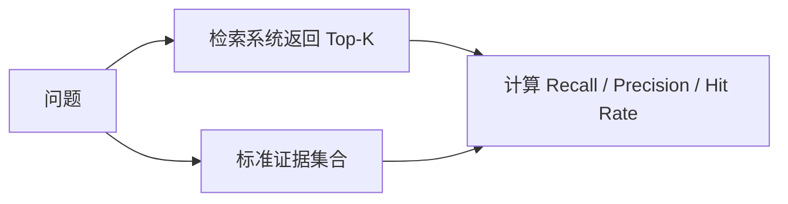

## 1. 背景
- **问题场景**: 很多 RAG 问题并不是生成模型回答差，而是检索阶段根本没把关键上下文找回来。
- **学习目标**: 学会把 RAG 问题拆解到检索层，建立更可解释的指标体系。
- **前置知识**: 了解向量检索、Top-K、Chunk、Embedding 和 RAG 基本结构。

## 2. 核心结论
- 检索阶段评测至少要能回答“该找回的内容有没有找回”和“找回来的内容是否相关”。
- `recall`、`precision`、`hit rate`、`MRR` 这些指标关注点不同，不能混用。
- 检索指标低时，优先排查 chunk 策略、embedding 选择和召回 Top-K。
- 检索问题如果不单独评估，很容易被误判成模型生成问题。

## 3. 原理拆解
- **关键概念**: Recall 看应该召回的信息是否找回，Precision 看召回结果里有多少是有用的。
- **运行机制**: 先准备带标准答案或标准证据的测试集，再将系统召回结果与参考证据对比。
- **图示说明**: 检索评测本质是比较“系统召回结果”和“理想证据集合”之间的重叠关系。



## 4. 实战步骤

### 4.1 环境准备
- 依赖版本: `ragas`、`datasets`
- 安装命令:

```bash
pip install ragas datasets
```

### 4.2 核心代码

```python
test_case = {
    "question": "订单超时会如何关闭？",
    "retrieved_contexts": [
        "支付超时后订单会自动关闭。",
        "订单状态流转由状态机驱动。",
    ],
    "gold_contexts": [
        "支付超时后订单会自动关闭。"
    ],
}


def hit_rate(case: dict) -> int:
    return int(any(ctx in case["retrieved_contexts"] for ctx in case["gold_contexts"]))
```

### 4.3 如何验证
- 本地运行命令: 批量跑测试集并汇总检索指标。
- 预期结果: 能看出召回不足、召回噪声过大或排序不合理等问题。
- 失败时重点检查: 标准证据是否准确、chunk 粒度是否过粗或过细、Top-K 设置是否过小。

```bash
python rag_retrieval_eval.py
```

## 5. 项目实践建议
- **适用场景**: 企业知识问答、内部助手、复杂文档问答系统。
- **不适用场景**: 完全没有测试集、只做一次演示、不要求稳定优化闭环的原型。
- **落地建议**: 检索指标和生成指标分开看，报告中明确区分问题归因。
- **与其他方案对比**: 与只看最终答案相比，检索指标更适合定位 RAG 系统的根因。

## 6. 踩坑记录
- **常见问题**: 用很主观的“我觉得这段也差不多”来代替标准证据。
- **错误现象**: 指标结果不稳定，团队对结论缺乏共识。
- **定位方式**: 抽样回看 gold contexts 是否明确、是否可复现、是否被不同评估者一致理解。
- **解决方案**: 建立清晰的标注口径，把“标准证据”定义成可被验证的事实片段。

## 7. 面试高频 Q&A
### Q1: 为什么 RAG 评测要把检索和生成分开？
### A1:
因为这是两个不同阶段。检索错和生成错的优化手段完全不同，混在一起看会让定位失真。

### Q2: Hit Rate 高是不是就代表检索好？
### A2:
不一定。Hit Rate 只能说明“有没有命中”，不能说明排序是否合理、噪声是否过大，也不能代表最终回答一定好。

## 8. 延伸阅读
- [Ragas Metrics](https://docs.ragas.io/en/stable/concepts/metrics/)
- [Ragas Documentation](https://docs.ragas.io/)
- [Information Retrieval Evaluation](https://en.wikipedia.org/wiki/Evaluation_measures_(information_retrieval))

## 9. 关联内容
- 相关笔记: [使用 Ragas 建立 RAG 评测基础](../basics/ragas_rag_evaluation_basics.md)
- 相关代码: [Ragas README](../README.md)
- 相关测试: 后续可在 `projects/` 中补 retrieval benchmark

---
[返回首页](../../../../README.md)
