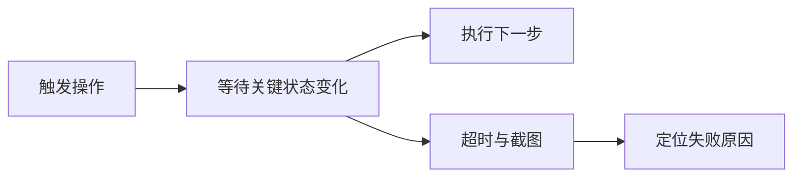

## 1. 背景
- **问题场景**: 移动端页面加载、动画、权限弹窗、系统切换都更复杂，脚本比 Web 更容易出现偶发失败。
- **学习目标**: 掌握 Appium 中的等待与稳定性设计思路，降低 flaky case 比例。
- **前置知识**: 了解显式等待、隐式等待和页面元素定位基础。

## 2. 核心结论
- 移动端自动化最忌讳大面积固定睡眠。
- 显式等待应该围绕页面状态和业务动作展开，而不是单纯等元素出现。
- 稳定性问题通常来自页面状态不可观测，而不仅仅是等待时间不够。
- 处理弹窗、动画、网络慢和系统切后台，要有专门的策略。

## 3. 原理拆解
- **关键概念**: 等待本质上是在为“页面状态变化的不确定性”兜底。
- **运行机制**: 测试脚本轮询关键条件，例如元素可点击、页面文案出现、加载动画消失或 Activity/页面切换完成。
- **图示说明**: 稳定性设计的重点不是单点等待，而是状态可观测与异常兜底。



## 4. 实战步骤

### 4.1 环境准备
- 依赖版本: Appium Python Client
- 安装命令:

```bash
pip install Appium-Python-Client
```

### 4.2 核心代码

```python
from selenium.webdriver.support.ui import WebDriverWait
from selenium.webdriver.support import expected_conditions as EC
from appium.webdriver.common.appiumby import AppiumBy


def wait_for_login_success(driver):
    wait = WebDriverWait(driver, 20)
    wait.until(
        EC.presence_of_element_located(
            (AppiumBy.ACCESSIBILITY_ID, "home_page_title")
        )
    )
```

### 4.3 如何验证
- 本地运行命令: 在真实设备或模拟器上执行登录或页面切换流程。
- 预期结果: 用例在网络抖动或加载稍慢时仍然稳定，不依赖大量 sleep。
- 失败时重点检查: 等待条件是否贴近真实页面状态、是否遗漏系统弹窗、是否需要截图和日志辅助排查。

```bash
python test_mobile_flow.py
```

## 5. 项目实践建议
- **适用场景**: 登录流程、支付流程、复杂页面跳转、多弹窗干扰场景。
- **不适用场景**: 完全无法观测页面状态、又拒绝输出可测性标识的页面。
- **落地建议**: 为关键页面设计统一的“页面 ready 条件”和公共等待组件。
- **与其他方案对比**: 与简单 `sleep` 相比，基于状态的显式等待更稳定、执行也更高效。

## 6. 踩坑记录
- **常见问题**: 看到失败就一味增加等待时间。
- **错误现象**: 用例越来越慢，但失败率并没有明显下降。
- **定位方式**: 分析失败截图、设备日志、页面状态和系统弹窗出现时机。
- **解决方案**: 明确每个关键页面的进入条件、退出条件和异常分支，而不是盲目延长超时。

## 7. 面试高频 Q&A
### Q1: 为什么移动端比 Web 更容易出现 flaky case？
### A1:
因为移动端涉及动画、设备性能、系统弹窗、前后台切换和平台差异，状态变化更复杂也更难观测。

### Q2: 为什么说稳定性问题本质上是“状态设计问题”？
### A2:
因为如果你无法准确判断页面是否 ready，再多等待时间也只是碰运气。状态可观测，才有真正稳定的自动化。

## 8. 延伸阅读
- [Appium Actions](https://appium.io/docs/en/2.6/guides/actions/)
- [Selenium Expected Conditions](https://www.selenium.dev/documentation/webdriver/support_features/expected_conditions/)
- [Appium Inspector](https://github.com/appium/appium-inspector)

## 9. 关联内容
- 相关笔记: [Appium 会话管理与 Capability 设计](./appium_session_and_capability_design.md)
- 相关代码: [Appium README](../README.md)
- 相关测试: 后续可补页面 ready 条件模板

---
[返回首页](../../../../README.md)
