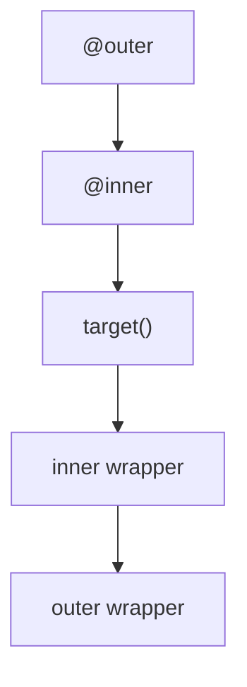

## 目录
- [概念](#概念)
- [核心机制](#核心机制)
- [代码示例](#代码示例)
- [易错点](#易错点)
- [小练习](#小练习)
- [Self-Check](#Self-Check)
- [参考答案](#参考答案)
- [参考链接](#参考链接)
- [版本记录](#版本记录)

## 概念
- 装饰器本质上是“接收一个可调用对象并返回另一个可调用对象”的高阶函数。
- 它非常适合横切关注点，例如日志、计时、重试、鉴权、缓存和埋点。
- 理解闭包与调用顺序后，装饰器就不再神秘。

## 核心机制
- `@decorator` 等价于 `func = decorator(func)`。
- 无参装饰器直接接收函数；带参装饰器会多一层工厂函数。
- `functools.wraps` 用于保留原函数名称、文档和签名元信息。
- 多个装饰器时，靠近函数定义的那个先应用，调用时则从外到内进入、从内到外返回。

## 代码示例
### 示例 1：无参装饰器

```python hl_lines="4 6 11"
from functools import wraps


def trace(func):
    @wraps(func)
    def wrapper(*args, **kwargs):
        print(f"calling {func.__name__}")
        return func(*args, **kwargs)
    return wrapper


@trace
def add(left: int, right: int) -> int:
    return left + right


print(add(2, 3))
```


### 示例 2：带参装饰器

```python hl_lines="4 5 8 15"
from functools import wraps


def repeat(times: int):
    def decorator(func):
        @wraps(func)
        def wrapper(*args, **kwargs):
            result = None
            for _ in range(times):
                result = func(*args, **kwargs)
            return result
        return wrapper
    return decorator


@repeat(3)
def greet() -> str:
    print("hello")
    return "done"


print(greet())
```


### 示例 3：类装饰器与执行顺序图



```python hl_lines="5 6 10"
class Prefix:
    def __init__(self, text: str) -> None:
        self.text = text

    def __call__(self, func):
        def wrapper(*args, **kwargs):
            return f"{self.text}:{func(*args, **kwargs)}"
        return wrapper


@Prefix("tag")
def status() -> str:
    return "ok"


print(status())
```

## 易错点
- 忘记使用 `@wraps`，会导致被装饰函数的名称、文档和调试信息丢失。
- 多层装饰器嵌套时，如果不清楚调用顺序，很容易在重试、计时、日志上得到意外行为。
- 把太多业务逻辑塞进装饰器，会让真实流程隐藏在语法糖背后，反而更难维护。

## 小练习
1. 写一个计时装饰器，打印函数执行秒数。
2. 写一个带参装饰器，只允许函数执行指定次数。
3. 写一个类装饰器，为函数返回值自动加前缀。


建议先手写一遍，再对照“参考答案”检查抽象边界是否清晰。

## Self-Check
### 概念题
1. 装饰器语法糖展开后是什么形式？
2. `wraps` 的主要作用是什么？
3. 多层装饰器的调用顺序如何理解？

### 编程题
1. 怎样给任何函数添加统一日志而不改函数体？
2. 带参装饰器为什么需要三层函数？

### 实战场景
1. 你要给所有接口调用函数统一加重试和耗时统计，为什么装饰器适合这个场景？

先独立作答，再对照下方的“参考答案”和对应章节复盘。

## 参考答案
### 概念题 1
`@decorator` 实际等价于 `target = decorator(target)`。理解这一点后，很多嵌套装饰器的行为就不难推导了。
讲解回看: [核心机制](#核心机制)

### 概念题 2
它会把原函数的 `__name__`、`__doc__` 等元信息复制到包装函数上，方便调试、日志和反射工具使用。
讲解回看: [核心机制](#核心机制)

### 概念题 3
应用时从下往上包裹，调用时从外层先进入，再逐层调用内层函数，最后再一层层返回。
讲解回看: [代码示例](#代码示例)

### 编程题 1
定义一个装饰器，在包装函数里记录入参与返回值，再调用原函数并返回结果即可。
讲解回看: [代码示例](#代码示例)

### 编程题 2
第一层接收装饰器参数，第二层接收被装饰函数，第三层是真正的运行时包装器，这样装饰器参数和函数调用参数才能分离。
讲解回看: [核心机制](#核心机制)

### 实战场景 1
因为这类逻辑与业务本身是横切关注点。用装饰器可以把公共能力集中在一处实现，避免在每个函数里重复写相同模板代码。
讲解回看: [概念](#概念)

## 参考链接
- [Python 官方文档](https://docs.python.org/3/)
- [本仓库知识模板](../../common/docs/template.md)

## 版本记录
- 2026-04-16: 初版整理，补齐示例、自测题与落地建议。

---
[返回 Python 学习总览](../README.md)
