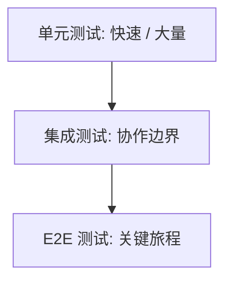

## 1. 背景
- **问题场景**: 团队常见的问题不是“没有测试”，而是测试结构失衡，导致回归慢、维护贵、反馈迟。
- **学习目标**: 建立测试金字塔和回归分层意识，知道不同层级的测试应该承担什么职责。
- **前置知识**: 了解单元测试、集成测试、E2E 测试和基本 CI 流程。

## 2. 核心结论
- 测试金字塔的核心不是层级名字，而是反馈速度、成本和覆盖目标的平衡。
- 越靠底层的测试应越多、越快、越稳定；越靠上层的测试应越少、越聚焦关键路径。
- 回归集分层可以让不同风险的问题在不同时间点被拦截。
- 如果 E2E 承担了太多职责，测试体系通常会变慢又脆弱。

## 3. 原理拆解
- **关键概念**: 单元测试负责快速反馈核心逻辑，集成测试负责验证协作边界，E2E 负责关键用户旅程。
- **运行机制**: 将测试按层级和执行时机拆分，例如提交即跑、合并前跑、夜间全量跑。
- **图示说明**: 回归分层的本质是按成本和价值分配验证责任。



## 4. 实战步骤

### 4.1 环境准备
- 依赖版本: 无强制工具依赖
- 安装命令: 无

```bash
echo "Design regression layers before scaling test count"
```

### 4.2 核心代码

```python
regression_layers = {
    "commit": ["unit", "selected_api"],
    "merge_request": ["unit", "api", "critical_e2e"],
    "nightly": ["full_api", "full_e2e", "performance_smoke"],
}
```

### 4.3 如何验证
- 本地运行命令: 无统一命令，重点在于梳理流水线与用例分层。
- 预期结果: 提交阶段反馈快，合并前风险覆盖足，夜间任务承担大回归。
- 失败时重点检查: 是否把过多慢测试放到了最早阶段，或关键路径没被独立保留。

```bash
python regression_layers.py
```

## 5. 项目实践建议
- **适用场景**: 需要持续交付、多人协作、回归成本持续上升的团队。
- **不适用场景**: 非持续迭代、一次性交付且规模极小的项目。
- **落地建议**: 给每类测试明确“执行时机、目标问题、成功标准、维护责任”。
- **与其他方案对比**: 与一股脑全量回归相比，分层策略更符合工程效率。

## 6. 踩坑记录
- **常见问题**: 把 E2E 当成主力，试图覆盖所有业务细节。
- **错误现象**: 回归耗时越来越长，失败定位困难，团队逐渐不信任测试结果。
- **定位方式**: 统计不同层级用例数量、执行时长、失败定位成本。
- **解决方案**: 把能下沉到单元或集成层的问题尽量下沉，只保留关键用户旅程在 E2E 层。

## 7. 面试高频 Q&A
### Q1: 测试金字塔最想解决什么问题？
### A1:
它想解决的是“测试反馈太慢、太贵、太脆弱”的问题，通过合理分层把验证责任放在最合适的位置。

### Q2: 为什么很多团队的 E2E 会失控？
### A2:
因为底层测试不足时，团队会把大量本该在单元或集成层发现的问题都堆到 E2E 上，最终导致慢和不稳定。

## 8. 延伸阅读
- [Martin Fowler - Test Pyramid](https://martinfowler.com/articles/practical-test-pyramid.html)
- [Google Testing Blog](https://testing.googleblog.com/)
- [全链路测试策略与计划](../test_strategy.md)

## 9. 关联内容
- 相关笔记: [基于风险的测试方法基础](./risk_based_testing_basics.md)
- 相关代码: [test_unit_salary.py](../tests/test_unit_salary.py)
- 相关测试: 后续可继续补回归集拆分模板

---
[返回首页](../../../README.md)
