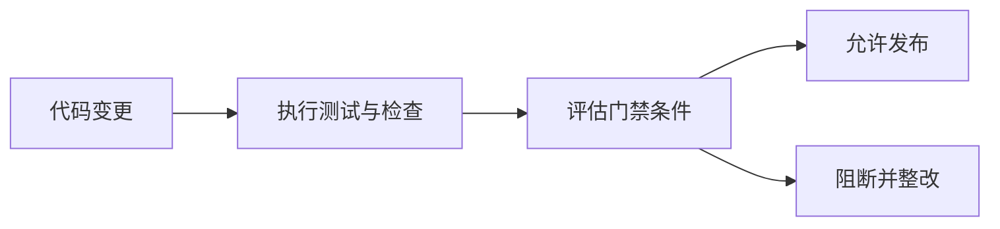

## 1. 背景
- **问题场景**: 只有测试活动，没有发布门禁，团队最终还是会在时间压力下带着风险上线。
- **学习目标**: 学会把测试结果转成清晰的发布准入条件，让质量要求可执行。
- **前置知识**: 了解测试覆盖率、缺陷分级、性能阈值和基本发布流程。

## 2. 核心结论
- 质量门禁的价值不是“卡人”，而是统一上线风险标准。
- 门禁必须可执行、可量化、可追责，不能停留在口号层。
- 通过率、覆盖率、缺陷分级、性能指标和安全要求是常见门禁维度。
- 门禁不是越多越好，而是越贴近风险越有效。

## 3. 原理拆解
- **关键概念**: 发布准入策略就是把“什么情况下允许上线”显式写成规则。
- **运行机制**: 在合并或发布前，自动或人工检查各类指标，未达标则阻断发布。
- **图示说明**: 门禁相当于在发布流程前增加一个统一的风险检查节点。



## 4. 实战步骤

### 4.1 环境准备
- 依赖版本: 可结合 CI、测试报告、覆盖率工具和缺陷系统
- 安装命令: 无固定要求

```bash
python scripts/check_quality_gate.py
```

### 4.2 核心代码

```python
quality_gate = {
    "test_pass_rate": 1.0,
    "line_coverage": 0.80,
    "branch_coverage": 0.75,
    "high_severity_defects": 0,
    "p95_latency_ms": 300,
}
```

### 4.3 如何验证
- 本地运行命令: `python scripts/check_quality_gate.py`
- 预期结果: 能明确告诉团队“是否允许进入下一阶段”，而不是只给出一堆分散数据。
- 失败时重点检查: 门禁指标是否和风险匹配、数据来源是否可信、阻断策略是否被绕开。

```bash
python scripts/check_quality_gate.py
```

## 5. 项目实践建议
- **适用场景**: 持续交付、多人协作、对稳定性有明确要求的业务团队。
- **不适用场景**: 纯探索性原型、没有稳定发布节奏的短期试验项目。
- **落地建议**: 先从少量高价值门禁开始，例如通过率、严重缺陷和关键性能指标。
- **与其他方案对比**: 与“上线前大家拍板”相比，门禁策略更透明、更可复盘。

## 6. 踩坑记录
- **常见问题**: 机械追求覆盖率数字，忽略高风险路径是否真正被验证。
- **错误现象**: 门禁看起来全部达标，但线上仍频繁出高严重事故。
- **定位方式**: 回看事故是否发生在未被覆盖的高风险路径，或门禁是否过度依赖表面指标。
- **解决方案**: 门禁指标要和风险分层配套，不要只盯单一数字。

## 7. 面试高频 Q&A
### Q1: 质量门禁为什么不能只用覆盖率？
### A1:
因为覆盖率只能说明“代码被跑到”，不能说明“关键风险被验证到”。门禁必须综合测试结果、缺陷和性能等维度。

### Q2: 门禁设计最大的失败方式是什么？
### A2:
最大的失败方式是规则看起来很多，但没有真正阻断能力，或者规则脱离业务风险，导致团队要么绕过，要么失去信任。

## 8. 延伸阅读
- [Google SRE - Release Engineering](https://sre.google/sre-book/release-engineering/)
- [ISTQB](https://www.istqb.org/)
- [质量门禁脚本](../../../scripts/check_quality_gate.py)

## 9. 关联内容
- 相关笔记: [测试金字塔与回归集分层策略](../methodologies/testing_pyramid_and_regression_layering.md)
- 相关代码: [check_quality_gate.py](../../../scripts/check_quality_gate.py)
- 相关测试: 后续可补发布准入 checklist 模板

---
[返回首页](../../../README.md)
