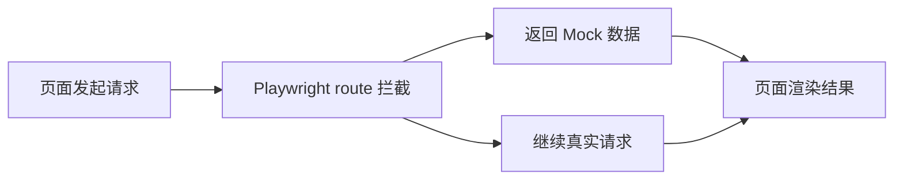

## 1. 背景
- **问题场景**: 前端页面常常依赖多个后端接口，真实联调环境不稳定时，UI 自动化容易被数据、权限和外部依赖拖垮。
- **学习目标**: 掌握 Playwright 的网络拦截和 Mock 思路，把 UI 用例从“依赖真实后端”改成“围绕页面行为稳定验证”。
- **前置知识**: 了解 HTTP 请求、接口返回结构、Playwright 基础定位和断言。

## 2. 核心结论
- 网络拦截的核心价值是把不稳定的外部依赖从 UI 回归里剥离出来。
- Mock 应该优先服务于页面行为验证，而不是把整套后端逻辑重新复制一遍。
- 对关键接口做最小必要 Mock，比全量拦截更容易维护。
- 拦截规则要尽量贴近业务语义，否则脚本会变成另一套难维护的后端实现。

## 3. 原理拆解
- **关键概念**: Playwright 通过 `page.route()` 或 `browser_context.route()` 拦截匹配到的请求，并决定继续、修改或伪造响应。
- **运行机制**: 页面发出请求后，路由规则先于真实网络生效，测试脚本可以在这一层控制请求流向和返回数据。
- **图示说明**: UI 测试里做网络 Mock，本质是在页面和真实服务之间插入一层可控代理。



## 4. 实战步骤

### 4.1 环境准备
- 依赖版本: `pytest-playwright`
- 安装命令:

```bash
pip install pytest-playwright
playwright install chromium
```

### 4.2 核心代码

```python
import pytest
from playwright.sync_api import Page, expect


@pytest.mark.ui
def test_dashboard_with_mocked_metrics(page: Page):
    page.route(
        "**/api/dashboard/metrics",
        lambda route: route.fulfill(
            status=200,
            content_type="application/json",
            body='{"success": true, "data": {"order_count": 128, "conversion": 0.27}}',
        ),
    )

    page.goto("https://example.com/dashboard")

    expect(page.get_by_text("128")).to_be_visible()
    expect(page.get_by_text("27%")).to_be_visible()
```

### 4.3 如何验证
- 本地运行命令: `pytest testing/ui/playwright/test_e2e_journey.py -q`
- 预期结果: 页面在无真实后端依赖的情况下完成核心展示和断言。
- 失败时重点检查: 路由匹配规则是否准确、返回 JSON 是否符合页面预期结构、断言是否针对真实渲染结果。

```bash
pytest testing/ui/playwright/test_e2e_journey.py -q
```

## 5. 项目实践建议
- **适用场景**: 仪表盘、活动页、报表页、依赖复杂后端的页面回归。
- **不适用场景**: 本质想验证前后端联通性和真实接口行为时。
- **落地建议**: 把页面渲染必须依赖的接口列成一张 Mock 白名单，分层管理。
- **与其他方案对比**: 与全部依赖联调环境相比，网络 Mock 更适合稳定的 UI 回归；与完全不校验数据渲染相比，它保留了页面行为验证价值。

## 6. 踩坑记录
- **常见问题**: Mock 返回结构和真实接口不一致。
- **错误现象**: 测试通过，但真实环境一跑页面就报错；或者测试始终失败但页面本身没问题。
- **定位方式**: 对照真实接口样本、浏览器开发者工具和前端类型定义核对字段。
- **解决方案**: 建议复用接口契约样本或统一由测试数据工厂生成 Mock 响应。

## 7. 面试高频 Q&A
### Q1: 为什么 UI 自动化里要做网络 Mock？
### A1:
为了把不稳定的依赖隔离掉，让用例更专注于页面行为和用户交互验证，而不是被测试环境拖垮。

### Q2: 网络 Mock 会不会让测试失去意义？
### A2:
不会，前提是你清楚它验证的是“页面行为”，不是“前后端联调链路”。两类测试应该分层存在，而不是互相替代。

## 8. 延伸阅读
- [Playwright Network](https://playwright.dev/python/docs/network)
- [Playwright API Mocking](https://playwright.dev/python/docs/mock)
- [Playwright Browser Contexts](https://playwright.dev/python/docs/browser-contexts)

## 9. 关联内容
- 相关笔记: [Playwright 选择器与自动等待基础](../basics/playwright_selector_and_waiting.md)
- 相关代码: [test_e2e_journey.py](../test_e2e_journey.py)
- 相关测试: 后续可在 `projects/` 中补完整页面对象模型方案

---
[返回首页](../../../../README.md)
